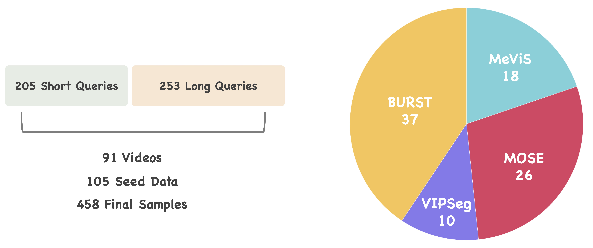

## ReasonVOS Benchmark

To effectively evaluate the reasoning segmentation task in videos, we construct a new benchmark, called ReasonVOS.
Note that this dataset is constructed based on existing video object segmentation datasets,
including [BURST](https://github.com/Ali2500/BURST-benchmark) (released under MIT License),
[VIPSeg](https://github.com/VIPSeg-Dataset/VIPSeg-Dataset) (released under `non-commercial research purpose only`),
[MOSE](https://github.com/henghuiding/MOSE-api) (released under CC BY-NC-SA 4.0 License),
and [MeViS](https://github.com/henghuiding/MeViS) (released under CC BY-NC-SA 4.0 License).

Shout out to these amazing works!!

### License Agreement
⚠️⚠️⚠️ By downloading, using, or sharing this dataset, you agree to comply with the licenses outlined above. 

<details>
<summary>Download</summary>

```
Google Drive: https://drive.google.com/file/d/1qruU9QlUhPcHnN-UHG7iri2nhw_xo7gP/view?usp=sharing
```

Please refer to [benchmark_check.py](benchmark_check.py) to explore the structure of the dataset.

</details>


### Statistics

<p align="center"> </p>

### License
The data of ReasonVOS is released for non-commercial research purpose only.

