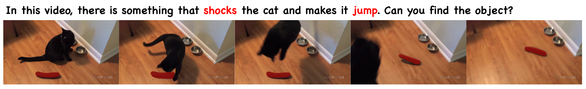

<div align="center">
<br>
<h2>One Token to Seg Them All: Language Instructed Reasoning Segmentation in Videos</h2>

[Zechen Bai](https://www.baizechen.site/) <sup>1</sup>&nbsp;
[Tong He](https://hetong007.github.io/) <sup>2</sup>&nbsp;
[Haiyang Mei](https://mhaiyang.github.io/) <sup>1</sup>&nbsp;
[Pichao Wang](https://wangpichao.github.io/) <sup>2</sup>&nbsp;

[Ziteng Gao](https://sebgao.github.io/) <sup>1</sup>&nbsp;
[Joya Chen](https://chenjoya.github.io/) <sup>1</sup>&nbsp;
[Lei Liu](https://openreview.net/profile?id=~liulei2) <sup>2</sup>&nbsp;
[Zheng Zhang](https://scholar.google.com/citations?user=k0KiE4wAAAAJ&hl=en) <sup>2</sup>&nbsp;
[Mike Zheng Shou](https://sites.google.com/view/showlab) <sup>1</sup>&nbsp;

NeurIPS 2024

<sup>1</sup> [Show Lab, National University of Singapore](https://sites.google.com/view/showlab/home?authuser=0) &nbsp; <sup>2</sup> Amazon&nbsp;
 
[](https://huggingface.co/ZechenBai/VideoLISA-3.8B)
[](https://arxiv.org/abs/2409.19603)

</div>

**News**
* **[2024-12-26]** We now support evaluation on image benchmarks, including refCOCO, etc.
* **[2024-12-08]** We updated the inference example and evaluation instructions on all datasets.
* **[2024-11-27]** We released the [ReasonVOS](BENCHMARK.md) benchmark!
* **[2024-11-26]** We released pre-trained VideoLISA-3.8B at [HuggingFace](https://huggingface.co/ZechenBai/VideoLISA-3.8B)!.
* **[2024-11-20]** We released the training and inference code.
* **[2024-09-29]** We released our paper on [arXiv](https://arxiv.org/abs/2409.19603).

<p align="center"> </p>

<p align="center"> </p>

## TODO
- [X] Release the inference code.
- [X] Release the training code.
- [X] Instructions on supporting more datasets.

## Setup Environment
```shell
git clone https://github.com/showlab/VideoLISA.git

conda create -n videolisa python=3.10 -y
conda activate videolisa
pip install --upgrade pip  # enable PEP 660 support


# for cuda 11.8
pip install torch==2.1.0 torchvision==0.16.0 --index-url https://download.pytorch.org/whl/cu118
# for cuda 12.1
pip install torch==2.1.0 torchvision==0.16.0 --index-url https://download.pytorch.org/whl/cu121

pip install -e .

pip install git+https://github.com/huggingface/transformers@a98c41798cf6ed99e1ff17e3792d6e06a2ff2ff3
pip install flash-attn --no-build-isolation
```

## Inference Example
```shell
CUDA_VISIBLE_DEVICES=0 python chat.py \
  --version="ZechenBai/VideoLISA-3.8B" \
  --vision_tower="openai/clip-vit-large-patch14-336" \
  --num_frames_dense=4 \
  --num_frames_sparse=32 \
  --save_overlay

> Please input your prompt: In this video, there is something that shocks the cat and makes it jump. Can you find the object?
> Please input the video path: examples/RBrZsgy4-SQ.mp4
```

<p align="center"> </p>


## Prepare Data for Training

First, please prepare the image data following this [instruction in LISA](https://github.com/dvlab-research/LISA/tree/main?tab=readme-ov-file#training-data-preparation).

We introduce the video datasets used in this project.
Note that the data paths for video datasets are currently hard-coded in each dataset file in the `utils` folder.
You may need to adjust it accordingly.

### ReasonVOS
Please refer to [BENCHMARK.md](BENCHMARK.md)

### MeViS
Download the dataset from the [official release](https://github.com/henghuiding/MeViS).
Then, extract and organize the file. We expect the directory structure to be the following:

```
mevis
├── train                       // Split Train
│   ├── JPEGImages
│   │   ├── <video #1  >
│   │   ├── <video #2  >
│   │   └── <video #...>
│   │
│   ├── mask_dict.json
│   └── meta_expressions.json
│
├── valid_u                     // Split Val^u
│   ├── JPEGImages
│   │   └── <video ...>
│   │
│   ├── mask_dict.json
│   └── meta_expressions.json
│
└── valid                       // Split Val
    ├── JPEGImages
    │   └── <video ...>
    │
    └── meta_expressions.json
```


### Ref-YouTube-VOS and Ref-DAVIS-17
Prepare Ref-YouTube-VOS and Ref-DAVIS-17 datasets following the instructions of [ReferFormer](https://github.com/wjn922/ReferFormer/blob/main/docs/data.md).

### YouTube-VOS
Download teh dataset from the [website](https://youtube-vos.org/dataset/vos/) and organize it as follows:
```
YTVOS
├── train
│   ├── JPEGImages
│   ├── Annotations
│   ├── meta.json
```

## Training
We provide a sample training script in `run_train.sh`.
In our own experiments, we use 8 node (64 A10 24G GPUs) in total to train the model.
Under this setting, we set `batch_size=2` and `grad_accumulation_steps=1`,
so that the global effective batch size is `batch_size*grad_accumulation_steps*num_gpus=128`.
You can modify these settings based on your hardwares.
However, we did not explore other training hyper-parameters.
If you don't have sufficient GPUs, don't give up, you may still try to train the model with small batch size.
One tip: if you use small batch size, also reducing the learning rate might help.

After training finished, to get the full model weight:
```shell
cd ./runs/video-lisa-3.8b-3k-iter/ckpt_model && python zero_to_fp32.py . ../pytorch_model.bin
```

### Weight merging
Since the script do LoRA training with the help of deepspeed by default, after training, you need to merge the lora weights back to the model.
```shell
CUDA_VISIBLE_DEVICES="" python merge_lora_weights_and_save_hf_model.py \
  --version="MBZUAI/LLaVA-Phi-3-mini-4k-instruct" \
  --weight="runs/video-lisa-3.8b-3k-iter/pytorch_model.bin" \
  --save_path="runs/video-lisa-3.8b-3k-iter/merged"
```

## Evaluation

### MeViS

Before jumping into the follow commands, you may look into the involved scripts and config the data paths.
```shell
# Step 1
bash evaluation/mevis_val_u/run_inference_mevis.sh

# Step 2
bash evaluation/mevis_val_u/run_eval_mevis.sh
```

### ReasonVOS

```shell
# Step 1
bash evaluation/reason_vos/run_inference_reason_vos.sh

# Step 2
bash evaluation/reason_vos/run_eval.sh
```


### Ref-YouTube-VOS
```shell
bash evaluation/refytvos/run_inference_refytvos.sh
```

Submit your result to the online evaluation [server](https://codalab.lisn.upsaclay.fr/competitions/3282#participate-submit_results).

### Ref-DAVIS-17
```shell
# Step 1
bash evaluation/refdavis/run_inference_refdavis.sh

# Step 2
bash evaluation/refdavis/run_post_process.sh
```

### Image Benchmarks
To support evaluation on the image benchmarks, including ReasonSeg and refCoco series, we proved a holistic script as below.
First, prepare image data following [instruction in LISA](https://github.com/dvlab-research/LISA/tree/main?tab=readme-ov-file#training-data-preparation).
After that,
```shell
deepspeed --master_port=24999 evaluation/eval_img/val.py \
  --version="ZechenBai/VideoLISA-3.8B" \
  --dataset_dir='/data_sdf/LLM_DATA/LISA/datasets' \
  --vision_pretrained="/home/ubuntu/ckpt/SAM/sam_vit_h_4b8939.pth" \
  --vision_tower="openai/clip-vit-large-patch14-336" \
  --num_frames_sparse=32 \
  --num_frames_dense=4 \
  --model_max_length=2048 \
  --eval_only \
  --val_dataset="ReasonSeg|val"

# --val_dataset can be changed to:
# ReasonSeg subsets: ReasonSeg|val, ReasonSeg|test|short, ReasonSeg|val|long, ReasonSeg|val|all
# refCOCO variants: refcoco|unc|testA, refcoco|unc|testB, refcoco+|unc|testA, refcoco+|unc|testB, refcocog|umd|test, refcoco|unc|val, refcoco+|unc|val, refcocog|umd|val
```


## Citation
To cite the paper and model, please use the below:
```
@article{bai2024one,
  title={One token to seg them all: Language instructed reasoning segmentation in videos},
  author={Bai, Zechen and He, Tong and Mei, Haiyang and Wang, Pichao and Gao, Ziteng and Chen, Joya and Liu, Lei and Zhang, Zheng and Shou, Mike Zheng},
  journal={arXiv preprint arXiv:2409.19603},
  year={2024}
}
```
### Acknowledgments
This work is heavily based on [LISA](https://github.com/dvlab-research/LISA/), [LLaVA](https://github.com/haotian-liu/LLaVA), [LLaVA-pp](https://github.com/mbzuai-oryx/LLaVA-pp), [Segment-Anything](https://github.com/facebookresearch/segment-anything) and [Phi-3](https://github.com/microsoft/Phi-3CookBook). Thanks to all the authors for their great works!
